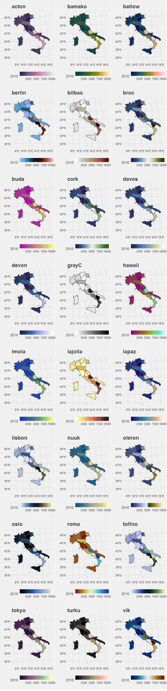
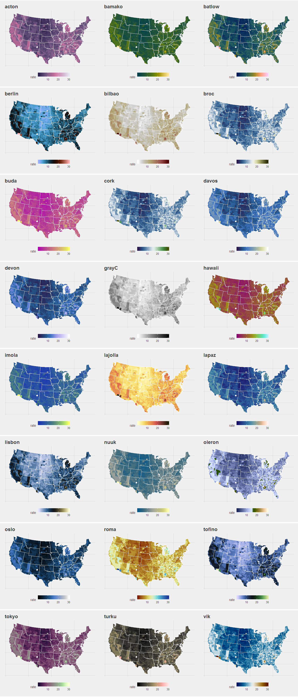

# Scientific colours - few minimal examples

## Introduction 

Quoting http://www.fabiocrameri.ch/visualisation.php 

> Scientific colour-maps are perceptually uniform, perceptually ordered, readable as B&W print and colour-vision-deficiency friendly. Freely available: viridis, scico, etc. One should not use colour-maps like the rainbow (jet) colour map distort, hide, and falsify the underlying data, do not render well when printed in black and white (see #endrainbow).    

## How to reproduce the results ? 

Please, see the Rmd file for details and the html file to see what should be the output when you run the entire notebook. To reproduce the results:

 - clone this repo
 - Install R and Rstudio (official stable version)
 - Install the libraries using (all are not required but I'm too lazy to sort them): 
 ```
install.packages(
   c(
   'spdep', 'maps', 'maptools', 'leaflet', 'rgdal', 'sf',
   'viridis', 'RColorBrewer', 'scico',
   'rvest', 'httr',
   'data.table', 'rio',
   'magrittr',
   'tidyverse',
   'ggthemes',
   'cowplot',
   'parallel', 'doParallel'
   )
 )
```
 - In the Rmd file, change the paths accordingly to the path where you cloned the repo (use Ctrl+F on `read_`, `D:/` and `C:/` to find all the inputs)

Then you're ready to knit or run the Rmd notebook. You can compare the resulting ouput with mine.

Enjoy ;)


## Examples






## Session info

```r
R version 3.5.1 (2018-07-02)
Platform: x86_64-w64-mingw32/x64 (64-bit)
Running under: Windows 7 x64 (build 7601) Service Pack 1

Matrix products: default

locale:
[1] LC_COLLATE=English_United States.1252  LC_CTYPE=English_United States.1252    LC_MONETARY=English_United States.1252
[4] LC_NUMERIC=C                           LC_TIME=English_United States.1252    

attached base packages:
[1] parallel  stats     graphics  grDevices utils     datasets  methods   base     

other attached packages:
 [1] doParallel_1.0.11  iterators_1.0.10   foreach_1.4.4      cowplot_0.9.3      plotly_4.8.0       ggthemes_4.0.1     forcats_0.3.0     
 [8] stringr_1.3.1      dplyr_0.7.6        purrr_0.2.5        readr_1.1.1        tidyr_0.8.1        tibble_1.4.2       tidyverse_1.2.1   
[15] magrittr_1.5       caret_6.0-80       ggplot2_3.0.0      lattice_0.20-35    rio_0.5.10         data.table_1.11.4  mgcv_1.8-24       
[22] nlme_3.1-137       httr_1.3.1         rvest_0.3.2.9000   xml2_1.2.0         scico_1.0.0        RColorBrewer_1.1-2 viridis_0.5.1     
[29] viridisLite_0.3.0  sf_0.6-3           rgdal_1.3-4        leaflet_2.0.2      maptools_0.9-4     maps_3.3.0         spdep_0.7-9       
[36] spData_0.2.9.4     Matrix_1.2-14      sp_1.3-1          

loaded via a namespace (and not attached):
 [1] colorspace_1.3-2   deldir_0.1-15      class_7.3-14       pls_2.7-0          rstudioapi_0.7     DRR_0.0.3          lubridate_1.7.4   
 [8] prodlim_2018.04.18 codetools_0.2-15   splines_3.5.1      robustbase_0.93-2  knitr_1.20         RcppRoll_0.3.0     jsonlite_1.5      
[15] broom_0.5.0        ddalpha_1.3.4      kernlab_0.9-27     sfsmisc_1.1-2      shiny_1.1.0        mapproj_1.2.6      compiler_3.5.1    
[22] backports_1.1.2    assertthat_0.2.0   lazyeval_0.2.1     cli_1.0.0          later_0.7.5        htmltools_0.3.6    tools_3.5.1       
[29] bindrcpp_0.2.2     coda_0.19-2        gtable_0.2.0       glue_1.3.0         reshape2_1.4.3     gmodels_2.18.1     Rcpp_0.12.18      
[36] cellranger_1.1.0   gdata_2.18.0       crosstalk_1.0.0    timeDate_3043.102  gower_0.1.2        openxlsx_4.1.0     mime_0.5          
[43] gtools_3.8.1       DEoptimR_1.0-8     LearnBayes_2.15.1  MASS_7.3-50        scales_1.0.0       ipred_0.9-7        hms_0.4.2         
[50] promises_1.0.1     expm_0.999-3       yaml_2.2.0         curl_3.2           gridExtra_2.3      rpart_4.1-13       stringi_1.1.7     
[57] e1071_1.7-0        boot_1.3-20        zip_1.0.0          lava_1.6.3         geometry_0.3-6     rlang_0.2.2        pkgconfig_2.0.2   
[64] bindr_0.1.1        labeling_0.3       recipes_0.1.3      htmlwidgets_1.2    CVST_0.2-2         tidyselect_0.2.4   plyr_1.8.4        
[71] R6_2.2.2           dimRed_0.1.0       DBI_1.0.0          pillar_1.3.0       haven_1.1.2        foreign_0.8-70     withr_2.1.2       
[78] units_0.6-1        nnet_7.3-12        survival_2.42-3    abind_1.4-5        modelr_0.1.2       crayon_1.3.4       grid_3.5.1        
[85] readxl_1.1.0       ModelMetrics_1.2.0 digest_0.6.17      classInt_0.2-3     xtable_1.8-3       httpuv_1.4.5       stats4_3.5.1      
[92] munsell_0.5.0      magic_1.5-9    
```