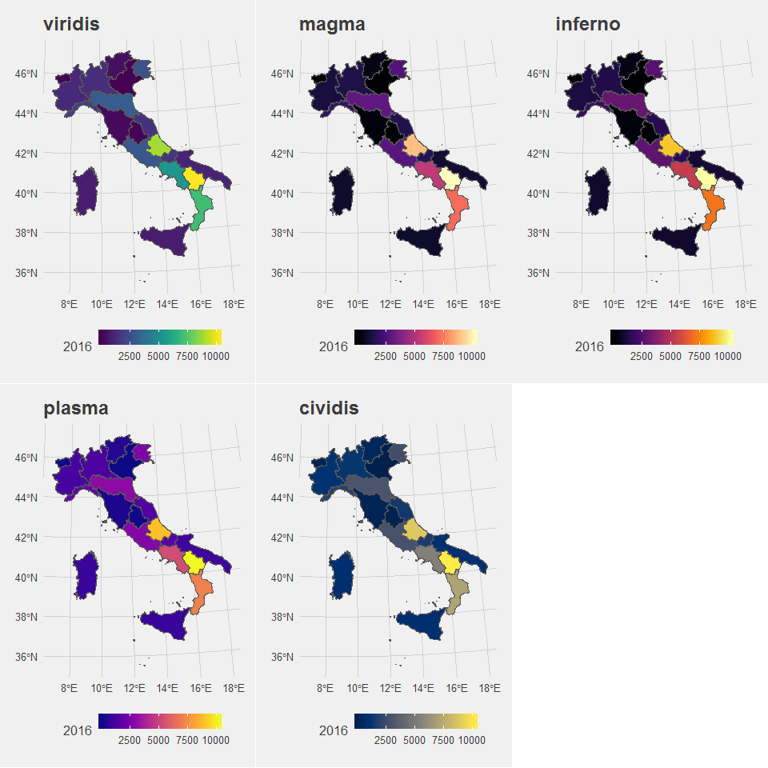
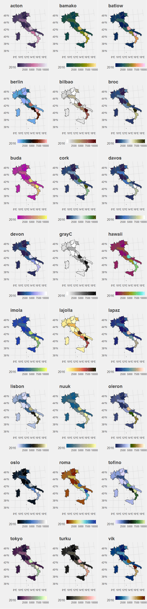
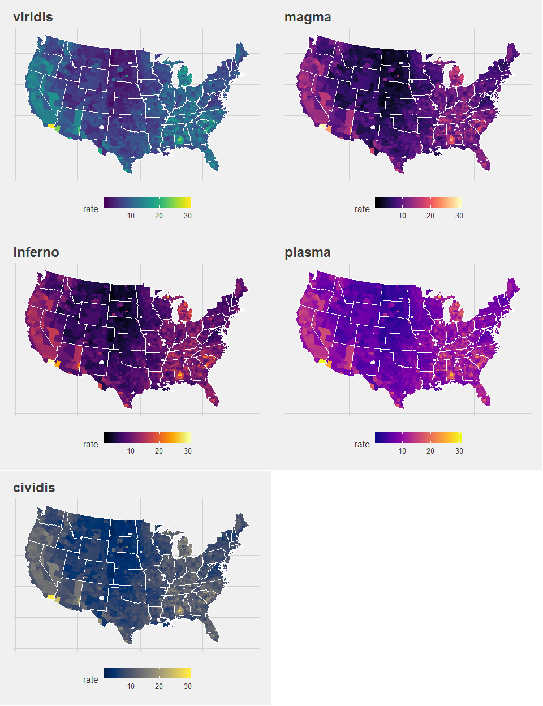
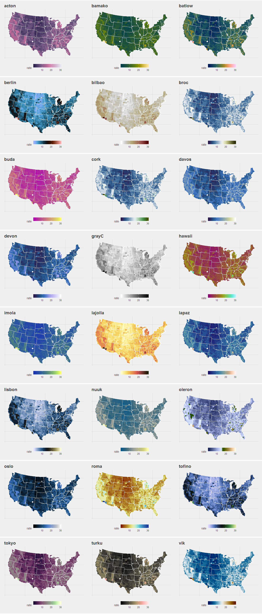
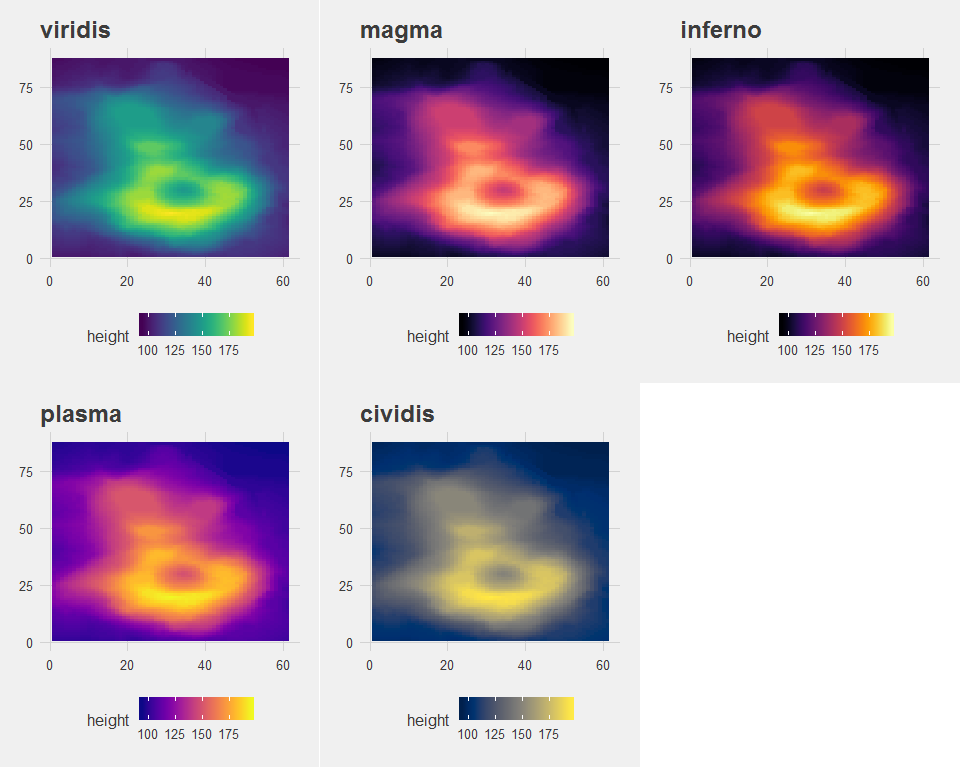
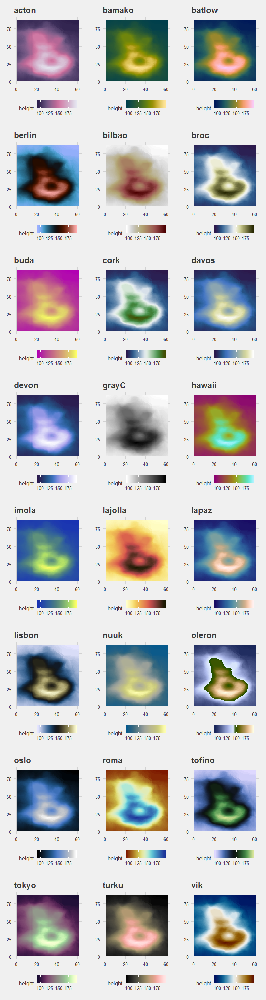
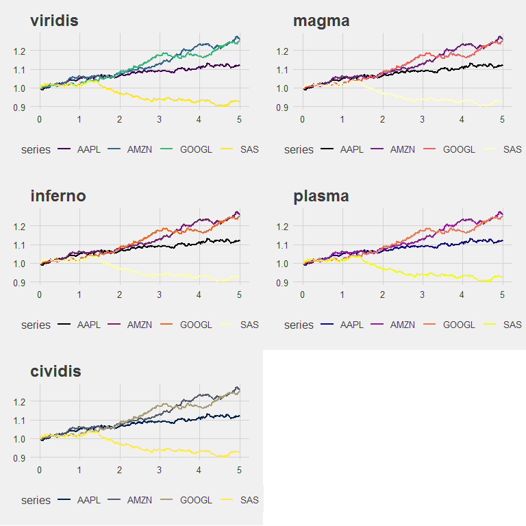
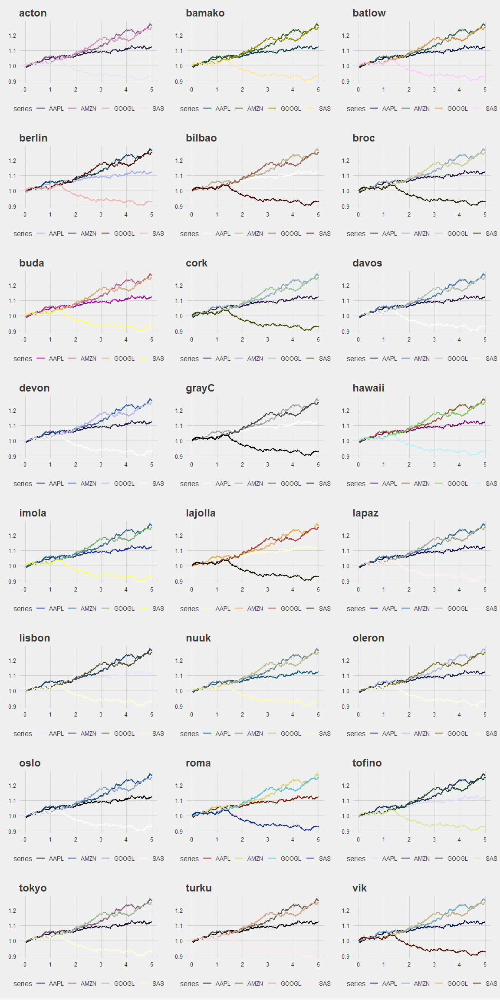
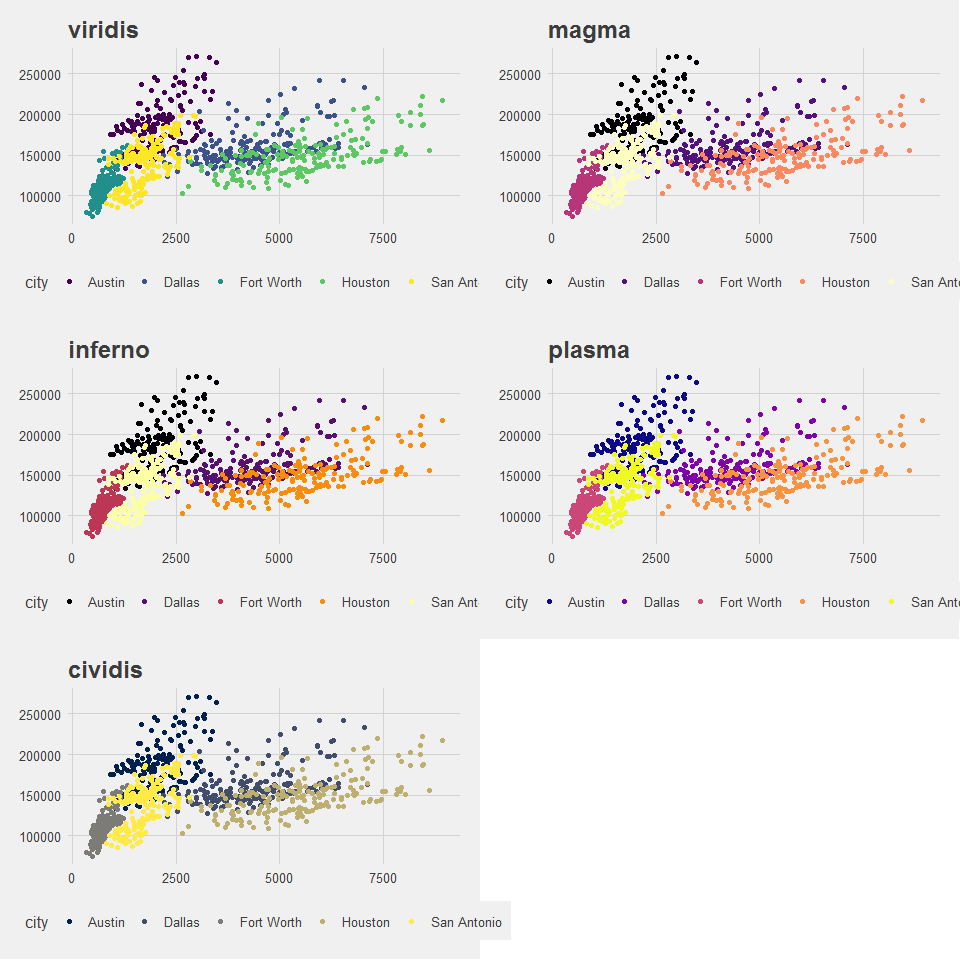
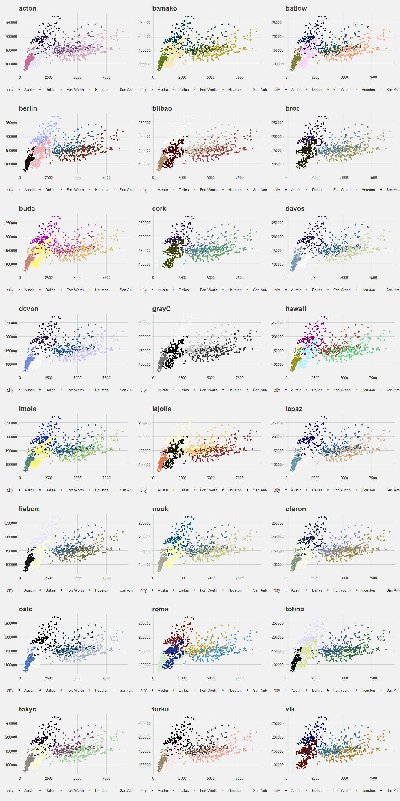

Scientific colours - few minimal examples
================
Thomas Bury
2018-10-26


Introduction
============

To avoid to waste time trying different color palettes for different kind of charts, I built this minimal examples for maps, heatmaps, line-plots and scatter plots. Those color palettes are based on [scientific colors](http://www.fabiocrameri.ch/colourmaps.php). Thefollowing examples are based on:

-   [Visualising Italian wine production](https://www.mango-solutions.com/blog/visualising-italian-wine-production)
-   [GGplot2 documentation](https://ggplot2.tidyverse.org/reference/scale_viridis.html)
-   [The viridis vignette](https://cran.r-project.org/web/packages/viridis/vignettes/intro-to-viridis.html)

Special thanks to the Authors who provided such useful palettes.

Maps
====

Italy - wine production
-----------------------

``` r
wine <- fread("Data/wine.csv", header=TRUE)
italy <- st_read("Data/Limiti_2016_ED50_g/Reg2016_ED50_g/Reg2016_ED50_g.shp")
```

    ## Reading layer `Reg2016_ED50_g' from data source `D:\Users\EUDZ040\R-open\003_Scientific_colors\Data\Limiti_2016_ED50_g\Reg2016_ED50_g\Reg2016_ED50_g.shp' using driver `ESRI Shapefile'
    ## Simple feature collection with 20 features and 4 fields
    ## geometry type:  MULTIPOLYGON
    ## dimension:      XY
    ## bbox:           xmin: 313361 ymin: 3934041 xmax: 1312106 ymax: 5220492
    ## epsg (SRID):    NA
    ## proj4string:    +proj=utm +zone=32 +ellps=intl +units=m +no_defs

``` r
# your data will need to have these region names
print(unique(italy$REGIONE))
```

    ##  [1] Piemonte              Valle D'Aosta         Lombardia            
    ##  [4] Veneto                Trentino-Alto Adige   Liguria              
    ##  [7] Friuli Venezia Giulia Emilia-Romagna        Toscana              
    ## [10] Umbria                Marche                Molise               
    ## [13] Lazio                 Abruzzo               Puglia               
    ## [16] Campania              Calabria              Sicilia              
    ## [19] Sardegna              Basilicata           
    ## 20 Levels: Abruzzo Basilicata Calabria Campania ... Veneto

``` r
levels(italy$REGIONE) <- wine$Region
WineLocation <- full_join(italy, wine, by = c("REGIONE" = "Region"))
```

    ## Warning: Column `REGIONE`/`Region` joining factor and character vector,
    ## coercing into character vector

``` r
plot_wine <- ggplot(data = WineLocation, aes(fill = `2016`)) + 
  geom_sf() + theme_fivethirtyeight() + guides(fill = guide_colorbar(barwidth = 8, barheight = 1))
```

### Viridis color palettes

``` r
plot_list <- list()

viridis_pal_names <- c('viridis', 'magma', 'inferno', 'plasma', 'cividis')
n_names = length(scico_pal_names)

for (i in seq(1,5)) {
  plot_list[[i]] <- plot_wine + scale_fill_viridis(option=viridis_pal_names[i]) + ggtitle(viridis_pal_names[i])  
}
```

Grid them, grid'em all

``` r
do.call(plot_grid, c(plot_list, ncol=3))
```



### Scico color palettes

``` r
plot_list <- list()

scico_pal_names <- scico::scico_palette_names()
n_names = length(scico_pal_names)

for (i in seq(1,n_names)) {
  plot_list[[i]] <- plot_wine + ggtitle(scico_pal_names[i]) + scale_fill_scico(palette = scico_pal_names[i])
}
```

Grid them, grid'em all

``` r
do.call(plot_grid, c(plot_list, ncol=3))
```



US - unemployment 2009 (crisis effect)
--------------------------------------

``` r
# Load the USmap
unemp <- read.csv("http://datasets.flowingdata.com/unemployment09.csv",
                  header = FALSE, stringsAsFactors = FALSE)
names(unemp) <- c("id", "state_fips", "county_fips", "name", "year",
                  "?", "?", "?", "rate")
unemp$county <- tolower(gsub(" County, [A-Z]{2}", "", unemp$name))
unemp$county <- gsub("^(.*) parish, ..$","\\1", unemp$county)
unemp$state <- gsub("^.*([A-Z]{2}).*$", "\\1", unemp$name)
county_df <- map_data("county", projection = "albers", parameters = c(39, 45))

# Build the choropleth and the states borders
names(county_df) <- c("long", "lat", "group", "order", "state_name", "county")
county_df$state <- state.abb[match(county_df$state_name, tolower(state.name))]
county_df$state_name <- NULL
state_df <- map_data("state", projection = "albers", parameters = c(39, 45))
choropleth <- merge(county_df, unemp, by = c("state", "county"))
choropleth <- choropleth[order(choropleth$order), ]

# The base plot
plot_county <- ggplot(choropleth, aes(long, lat, group = group)) +
  geom_polygon(aes(fill = rate)) +
  geom_polygon(data = state_df, colour = "white", fill = NA, size = .5) +
  coord_fixed() +
  theme_minimal() +
  ggtitle("US unemployment rate by county") + theme_fivethirtyeight() +
  guides(fill = guide_colorbar(barwidth = 8, barheight = 1)) +
  theme(axis.line = element_blank(), axis.text = element_blank(),
        axis.ticks = element_blank(), axis.title = element_blank()) 
```

Viridis color palettes
----------------------

``` r
plot_list <- list()

viridis_pal_names <- c('viridis', 'magma', 'inferno', 'plasma', 'cividis')
n_names = length(scico_pal_names)

for (i in seq(1,5)) {
  plot_list[[i]] <- plot_county + scale_fill_viridis(option=viridis_pal_names[i]) + ggtitle(viridis_pal_names[i])  
}
```

Grid them, grid'em all

``` r
do.call(plot_grid, c(plot_list, ncol=2))
```



Scico color palettes
--------------------

``` r
plot_list <- list()

scico_pal_names <- scico::scico_palette_names()
n_names = length(scico_pal_names)

for (i in seq(1,n_names)) {
  plot_list[[i]] <- plot_county + ggtitle(scico_pal_names[i]) + scale_fill_scico(palette = scico_pal_names[i])
}
```

Grid them, grid'em all

``` r
do.call(plot_grid, c(plot_list, ncol=3))
```



Volcano - topology
==================

Viridis color palettes
----------------------

``` r
rm(volcano)
```

    ## Warning in rm(volcano): oggetto "volcano" non trovato

``` r
volcano <- data.frame(
  x = rep(seq_len(ncol(volcano)), each = nrow(volcano)),
  y = rep(seq_len(nrow(volcano)), ncol(volcano)),
  height = as.vector(volcano)
)
```

``` r
plot_volcano <- ggplot(volcano, aes(x = x, y = y, fill = height)) + 
  geom_raster() + theme_fivethirtyeight()
```

``` r
plot_list <- list()

viridis_pal_names <- c('viridis', 'magma', 'inferno', 'plasma', 'cividis')
n_names = length(scico_pal_names)

for (i in seq(1,5)) {
  plot_list[[i]] <- plot_volcano + scale_fill_viridis(option=viridis_pal_names[i]) + ggtitle(viridis_pal_names[i])
}
```

Grid them, grid'em all

``` r
do.call(plot_grid, c(plot_list, ncol=3))
```



Scico color palettes
--------------------

``` r
plot_list <- list()

scico_pal_names <- scico::scico_palette_names()
n_names = length(scico_pal_names)

for (i in seq(1,n_names)) {
  plot_list[[i]] <- plot_volcano + ggtitle(scico_pal_names[i]) + scale_fill_scico(palette = scico_pal_names[i])
}
```

Grid them, grid'em all

``` r
do.call(plot_grid, c(plot_list, ncol=3))
```



Line charts - some made up financial quotes
===========================================

Completely made up stock quotes using simulation of geometrical Brownian motion (Wiener process).

NB: Those color schemes are best suited to continuous scales. You probably want to test colorbrewer palettes as well.

``` r
t_H = 5
N_ticks = 1000
increment = rep(t_H/N_ticks, N_ticks)
S0 = 1
sigma = 0.025
mu = 0.025
# because Iprefer Google, I'll increase its trend
dt_stocks <- data.table(time = cumsum(increment),
                 AAPL = S0*exp(cumsum((mu-sigma*sigma/2)*increment + sigma*sqrt(t_H/N_ticks)*rnorm(N_ticks))),
                 AMZN = S0*exp(cumsum((mu-sigma*sigma/2)*increment + sigma*sqrt(t_H/N_ticks)*rnorm(N_ticks))),
                 GOOGL = S0*exp(cumsum((1.5*mu-sigma*sigma/2)*increment + sigma*sqrt(t_H/N_ticks)*rnorm(N_ticks))),
                 SAS = S0*exp(cumsum((-mu-sigma*sigma/2)*increment + sigma*sqrt(t_H/N_ticks)*rnorm(N_ticks)))
                 )
dt_stocks <- melt(dt_stocks ,  id.vars = 'time', variable.name = 'series')

d <- ggplot(data = dt_stocks, aes(x = time, y = value)) + geom_line(aes(colour = series), size = 1) + theme_fivethirtyeight()
```

Viridis color palettes
----------------------

``` r
plot_list <- list()

viridis_pal_names <- c('viridis', 'magma', 'inferno', 'plasma', 'cividis')
n_names = length(scico_pal_names)

for (i in seq(1,5)) {
  plot_list[[i]] <- d + scale_colour_viridis_d(option=viridis_pal_names[i]) + ggtitle(viridis_pal_names[i])  
}
```

Grid them, grid'em all

``` r
do.call(plot_grid, c(plot_list, ncol=2))
```



Scico color palettes
--------------------

``` r
plot_list <- list()
n_names = length(scico_pal_names)

for (i in seq(1,n_names)) {
  plot_list[[i]] <- d + ggtitle(scico_pal_names[i]) + scico::scale_colour_scico_d(palette = scico_pal_names[i])
}
```

Grid them, grid'em all

``` r
do.call(plot_grid, c(plot_list, ncol=3))
```



Categorical variables - from the ggplot2 doc
============================================

Taking the Tidyverse example

``` r
txsamp <- subset(txhousing, city %in%
  c("Houston", "Fort Worth", "San Antonio", "Dallas", "Austin"))
d <- ggplot(data = txsamp, aes(x = sales, y = median)) + geom_point(aes(colour = city)) + theme_fivethirtyeight()
```

Viridis color palettes
----------------------

``` r
plot_list <- list()

viridis_pal_names <- c('viridis', 'magma', 'inferno', 'plasma', 'cividis')
n_names = length(scico_pal_names)

for (i in seq(1,5)) {
  plot_list[[i]] <- d + scale_colour_viridis_d(option=viridis_pal_names[i]) + ggtitle(viridis_pal_names[i])  
}
```

Grid them, grid'em all

``` r
do.call(plot_grid, c(plot_list, ncol=2))
```



Scico color palettes
--------------------

``` r
plot_list <- list()
n_names = length(scico_pal_names)

for (i in seq(1,n_names)) {
  plot_list[[i]] <- d + ggtitle(scico_pal_names[i]) + scico::scale_colour_scico_d(palette = scico_pal_names[i])
}
```

Grid them, grid'em all

``` r
do.call(plot_grid, c(plot_list, ncol=3))
```


